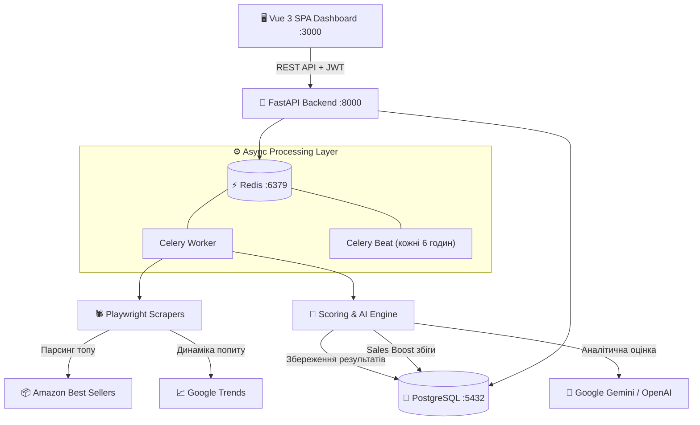

# e-Commerce Score — MVP Analytics Platform

Автоматизований сервіс парсингу, AI-скорингу та аналітики трендових товарів (e-Commerce) для платформи Amazon.

Система самостійно збирає товари з Amazon, оцінює їхній комерційний потенціал через динаміку трендів (**Google Trends**), історію внутрішніх продажів компанії (**Sales Boost**) та AI-аналітику (**Gemini / OpenAI**), видаючи результат у сучасному веб-дашборді на **Vue 3** з готовою оцінкою (Score: 0–100) та детальним обґрунтуванням (Reasoning) для баєрів.

---

## 🏗 Архітектурна схема



---

## 🚀 Запуск усієї платформи однією командою (Docker Compose)

1. Переконайся, що встановлено **Docker** та **Docker Compose**.
2. Перевір наявність файлу `Backend/.env` (за потреби скопіюй `Backend/.env.example` у `Backend/.env` та додай `LLM_API_KEY` для Gemini/OpenAI). Якщо ключ не вказано — система автоматично підніметься та працюватиме в автономному математичному режимі.
3. Запусти всю платформу командою з кореня проєкту:
   ```bash
   docker-compose up --build -d
   ```

*Усі міграції Alembic, генерація початкових даних та запуск 6 сервісів виконуються повністю автоматично без ручних налаштувань.*

### 🌐 Доступні адреси після запуску:
- 🖥 **Frontend (Веб-дашборд):** [http://localhost:3000](http://localhost:3000)
- 🔌 **Backend (Swagger API Docs):** [http://localhost:8000/docs](http://localhost:8000/docs)

---

## 👤 Вхід у систему (Тестовий доступ)

- **URL:** [http://localhost:3000/login](http://localhost:3000/login)

Також на сторінці входу доступна реєстрація нових користувачів або керування через консоль: `docker-compose exec backend python cli.py create-user -u admin -p admin`.

---

## 📊 Функціонал та можливості

### 1. Аналітичний дашборд товарів Amazon (`/products`):
- **Сводка метрик:** віджети кількості товарів, товарів з високим потенціалом (75+), середнього балу та статусу черг.
- **Два види відображення:** сучасна сітка карток з фото та детальна аналітична таблиця.
- **Фільтрація та пошук:** фільтри за реальними категоріями (*Electronics, Beauty, Home & Kitchen...*), слайдер мінімального балу та пошук за назвою.
- **Швидкі дії:** кнопки «Спарсити Amazon» та «AI Score».
- **Live-модальне вікно:** відстеження прогресу задач Celery у реальному часі (0%–100%) з живим терміналом логів подій.
- **Модальне вікно товару:** деталізація оцінки, показники Google Trends, Sales Boost та експертне аналітичне обґрунтування (Reasoning).
- **Прямі посилання:** швидкий перехід на картку товару на Amazon.

### 2. База знань Sales Boost (`/sales-boost`):
- **Імпорт через CSV:** Drag & Drop завантаження `.csv` файлів з автоматичним маппінгом колонок (наприклад, готовий `sample_sales_boost.csv`).
- **Ручне додавання:** модальна форма для швидкого внесення товару з тегами та ключовими словами.
- **Вплив на скоринг:** автоматичне нарахування до `+20` бонусних балів товарам з головного дашборду, що мають збіги за ключовими словами.

---

## 🧪 Автоматичні тести (Unit & Integration Tests)
У проєкті налаштовано тестовий набір, що покриває авторизацію (JWT, хешування), алгоритм зіставлення Sales Boost, імпорт CSV-файлів із валідацією колонок та математичний Fallback-скоринг без AI.
### Запуск тестів всередині контейнера:
```bash
docker-compose exec backend python tests/run_tests.py
```

## 🛠 Технічний стек

- **Backend:** Python 3.12, FastAPI, SQLAlchemy 2.0 (async), Alembic, Pydantic v2
- **Scraping:** Playwright + Playwright Stealth
- **Task Queue & Scheduler:** Celery, Celery Beat, Redis
- **Database:** PostgreSQL 16
- **Frontend:** Vue 3 Composition API,  Vite, Pinia, Vue Router, Tailwind CSS, Lucide Icons, Nginx
- **Orchestration:** Docker Compose
