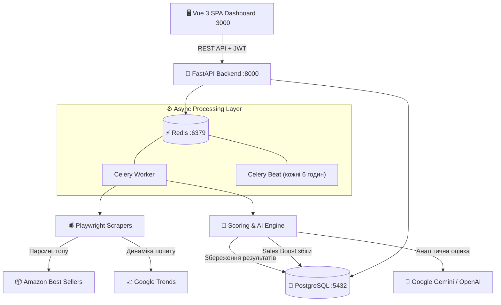

# e-Commerce Score — MVP Analytics Platform

Автоматизований сервіс парсингу, AI-скорингу та аналітики трендових товарів (e-Commerce) для платформи Amazon.

Система самостійно збирає товари з Amazon, оцінює їхній комерційний потенціал через динаміку трендів (**Google Trends**), історію внутрішніх продажів компанії (**Sales Boost**) та AI-аналітику (**Gemini / OpenAI**), видаючи результат у сучасному веб-дашборді на **Vue 3** з готовою оцінкою (Score: 0–100) та детальним обґрунтуванням (Reasoning) для баєрів.

---

## 🏗 Архітектурна схема



---

## 🚀 Швидкий запуск проєкту (Step-by-Step)

Переконайся, що на твоєму комп'ютері встановлено **Docker** та **Docker Compose**.

### Крок 1. Клонування репозиторію
```bash
git clone <URL_РЕПОЗИТОРІЮ>
cd <НАЗВА_ПАПКИ_ПРОЄКТУ>
```

### Крок 2. Створення файлу оточення (`.env`)
Скопіюй зразок `.env.example` у файл `.env` в корені проєкту:
```bash
cp .env.example .env
```

*(Опціонально)*: Якщо бажаєш увімкнути нейромережеву оцінку через Gemini або OpenAI, відкрий файл `.env` та вкажи API-ключ:
```ini
LLM_PROVIDER=gemini
LLM_API_KEY=AIzaSy...
LLM_MODEL=gemini-1.5-flash
```
> ** Зверни увагу:** Якщо ключ не вказано, система автоматично підніметься та працюватиме в автономному аналітичному режимі за повноцінною математичною формулою з ТЗ без жодних збоїв.

### Крок 3. Запуск платформи
Запусти всі 6 сервісів командою з кореня проєкту:
```bash
docker compose up --build -d
```
*(або `docker-compose up --build -d` залежно від версії Docker)*

Усі міграції бази даних (Alembic), створення початкового адміністратора (`seed.py`) та ініціалізація сервісів виконуються **повністю автоматично**.

---

### 🌐 Доступні вебадреси після запуску:
- 🖥 **Frontend (Веб-дашборд):** [http://localhost:3000](http://localhost:3000)
- 🔌 **Backend (Swagger API Docs):** [http://localhost:8000/docs](http://localhost:8000/docs)

---

## 👤 Тестовий доступ до системи

- **URL для входу:** [http://localhost:3000/login](http://localhost:3000/login)
- **Логін:** `admin`
- **Пароль:** `admin`

Також на сторінці входу доступна реєстрація нових акаунтів або керування користувачами через CLI:
```bash
docker compose exec backend python cli.py create-user -u admin -p admin
```

---

## 📊 Функціонал та можливості платформи

### 1. Аналітичний дашборд товарів Amazon (`/products`):
- **Сводка метрик:** віджети кількості товарів, товарів з високим потенціалом (75+), середнього балу та статусу черг.
- **Два види відображення:** сучасна сітка карток з фото та детальна аналітична таблиця.
- **Фільтрація та пошук:** фільтри за реальними категоріями (*Electronics, Beauty, Home & Kitchen...*), слайдер мінімального балу та живий пошук.
- **Швидкі дії:** кнопки «Спарсити Amazon» та «AI Score».
- **Live-модальне вікно:** відстеження прогресу задач Celery у реальному часі (0%–100%) з живим терміналом логів подій.
- **Модальне вікно товару:** деталізація оцінки, показники Google Trends, Sales Boost та експертне аналітичне обґрунтування (Reasoning).
- **Прямі посилання:** швидкий перехід на картку товару на Amazon.

### 2. База знань Sales Boost (`/sales-boost`):
- **Імпорт через CSV:** Drag & Drop завантаження `.csv` файлів з автоматичним маппінгом колонок (гоковий зразок `sample_sales_boost.csv` додано в корінь проєкту).
- **Ручне додавання:** модальна форма для швидкого внесення товару з тегами та ключовими словами.
- **Вплив на скоринг:** автоматичне нарахування до `+20` бонусних балів товарам з головного дашборду, що мають збіги за ключовими словами.

---

## 🧪 Автоматичні тести (Unit & Integration Tests)

У проєкті налаштовано повний набір автоматичних тестів, що покриває:
1. Автентифікацію (безпечне хешування bcrypt, кодування та валідацію JWT-токенів).
2. Алгоритм розрахунку та лімітування Sales Boost.
3. Валідацію та маппінг CSV-файлів різними мовами (En / Ukr).
4. Автономний математичний скоринг.

### Запуск тестів:
```bash
docker compose exec backend python tests/run_tests.py
```

---

## 🛠 Технічний стек

- **Backend:** Python 3.12, FastAPI, SQLAlchemy 2.0 (async), Alembic, Pydantic v2
- **Scraping:** Playwright + Playwright Stealth
- **Task Queue & Scheduler:** Celery, Celery Beat, Redis
- **Database:** PostgreSQL 16
- **Frontend:** Vue 3 Composition API, Vite, Pinia, Vue Router, Tailwind CSS, Lucide Icons, Nginx
- **Orchestration:** Docker Compose
